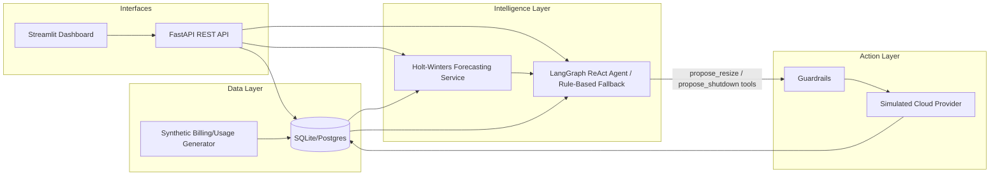

# FinOps Optimization Agent

An autonomous, tool-calling LLM agent that forecasts cloud compute utilization
and proposes (or executes) cost-optimizing resize/shutdown actions — a
production-shaped prototype of a corporate FinOps automation system.

## Problem Statement

Engineering teams routinely over-provision cloud compute and forget to scale
it back down. Enterprises lose meaningful budget every month to idle or
oversized EC2-style instances because right-sizing requires someone to
continuously correlate utilization history, forecast near-term demand, and
weigh that against the blast radius of touching a production system — work
that rarely happens manually at scale.

## Target Users

- **Platform/DevOps/SRE teams** who own a cloud budget and want automated,
  policy-bound right-sizing recommendations.
- **FinOps/engineering leadership** who need auditable, explainable cost
  optimization decisions rather than an opaque "auto-scaler."

## Key Features

- Synthetic but realistic hourly usage telemetry generation (idle,
  business-hours, steady-high and spiky profiles) standing in for a
  CloudWatch-style billing/metrics feed.
- Holt-Winters seasonal time-series forecasting of CPU utilization, with
  automatic fallback to a moving-average model when history is too short,
  and self-reported backtest MAE.
- A **LangGraph ReAct tool-calling agent** that reasons over usage summaries
  and forecasts, then calls `propose_resize` / `propose_shutdown` tools
  against a simulated cloud control plane.
- A **deterministic rule-based policy engine** implementing the exact same
  FinOps policy — used automatically when no LLM API key is configured, and
  used as the ground-truth baseline in the evaluation harness.
- **Guardrails enforced at the tool layer** (not just the prompt): production-
  tagged instances can never be shut down, regardless of what the LLM decides.
- `dry_run` semantics end-to-end: every action can be previewed before
  execution.
- An evaluation harness that scores agent decisions against a golden,
  hand-labeled dataset and reports accuracy.
- A Streamlit dashboard for fleet overview, forecasts, and triggering agent
  runs.

## Architecture



### System Workflow

1. Usage telemetry (hourly CPU/memory/network) accumulates per instance.
2. On an optimize request, the forecasting service fits a seasonal
   Holt-Winters model (or falls back to a moving average) to project CPU
   utilization over the next 7 days.
3. The agent — LLM ReAct if `LLM_PROVIDER` is configured with a key,
   otherwise the deterministic rule-based engine — evaluates trailing +
   forecasted CPU against policy thresholds and the instance's
   `criticality` tag.
4. The agent calls a tool to propose (or, if `dry_run=False`, execute) a
   `resize` or `shutdown`. Tools enforce guardrails independently of the
   agent's reasoning (e.g. production instances can never be shut down).
5. Every decision is persisted as an `AgentAction` row with its numeric
   reasoning and estimated monthly savings, giving a full audit trail.

## AI/ML/GenAI Methodology

- **Forecasting**: Holt-Winters exponential smoothing with additive trend and
  24-hour seasonality (`statsmodels`), chosen over Prophet to avoid a heavy
  native build toolchain for hourly, short-horizon operational forecasting.
  Backtested with a held-out 24-hour window and reported as MAE.
- **Agent orchestration**: `langgraph.prebuilt.create_react_agent` gives the
  LLM a fixed toolset (`list_all_instances`, `get_instance_usage_summary`,
  `get_forecast`, `propose_resize`, `propose_shutdown`) and a system prompt
  encoding the FinOps policy; the LLM must call the data tools before
  proposing an action rather than inferring numbers.
- **Hallucination mitigation**: the LLM never has authority to fabricate
  utilization numbers — all figures come from tool calls against the real
  (simulated) database — and destructive actions are re-validated by
  guardrails in the tool layer, not trusted from the LLM's text output.
- **Reliability**: LLM tool invocations are wrapped in retry-with-backoff
  (`tenacity`); on repeated failure, the run transparently falls back to the
  rule-based policy engine so the API never hard-fails.
- **Evaluation**: `evaluation/evaluate_agent.py` runs the active agent against
  a golden dataset of 8 labeled scenarios spanning all four policy branches
  (production/non-production × idle/steady) and reports accuracy plus a
  per-case breakdown, written to `evaluation/report.json`.

## Technology Stack

| Layer | Technology | Why |
|---|---|---|
| API | FastAPI + Pydantic v2 | Async-ready, typed request/response validation, auto OpenAPI docs |
| ORM/DB | SQLAlchemy 2.0 (SQLite default, Postgres-ready) | Zero-config local dev; swap `DATABASE_URL` for production |
| Forecasting | statsmodels (Holt-Winters) | Lightweight, pure-Python seasonal forecasting suited to hourly data |
| Agent orchestration | LangGraph (`create_react_agent`) + LangChain tools | Standard tool-calling ReAct pattern, model-agnostic |
| LLM providers | Anthropic / OpenAI (optional) | Pluggable via `LLM_PROVIDER`; app runs fully without either |
| Retry/reliability | `tenacity` | Exponential backoff around LLM tool invocations |
| Frontend | Streamlit | Fast, professional dashboard without a separate JS build |
| Testing | pytest | Unit, integration and guardrail tests |

## Project Structure

```text
finops-agent/
├── app/
│   ├── main.py                # FastAPI app, lifespan seeding, routers
│   ├── config.py               # Environment-driven settings
│   ├── db/                     # Engine, session, ORM models, init
│   ├── schemas/                # Pydantic request/response models
│   ├── services/                # Billing sim, forecasting, cost math, cloud provider
│   ├── agent/                   # Prompts, tools, rule-based engine, LangGraph orchestration
│   └── api/routes/              # instances, usage, forecast, agent endpoints
├── scripts/seed_data.py         # Demo fleet seeding
├── evaluation/                  # Golden dataset + evaluation harness
├── frontend/dashboard.py        # Streamlit UI
└── tests/                       # Unit + integration tests
```

## Setup Instructions

```bash
git clone <your-repo-url>
cd finops-agent
python -m venv .venv && source .venv/bin/activate
pip install -r requirements.txt
cp .env.example .env
```

By default `LLM_PROVIDER=none`, so the app runs immediately on the
deterministic rule-based policy with no API key required. To use a real LLM
agent, set `LLM_PROVIDER=anthropic` (or `openai`) and the matching API key in
`.env`.

## Environment Variables

| Variable | Description | Default |
|---|---|---|
| `DATABASE_URL` | SQLAlchemy connection string | `sqlite:///./finops.db` |
| `LLM_PROVIDER` | `anthropic` \| `openai` \| `none` | `none` |
| `ANTHROPIC_API_KEY` / `OPENAI_API_KEY` | Provider API key | unset |
| `LLM_MODEL` | Model name for the selected provider | `claude-3-5-sonnet-20241022` |
| `UNDERUTILIZED_CPU_THRESHOLD` | % below which CPU is "underutilized" | `15.0` |
| `FORECAST_HORIZON_HOURS` | Forecast horizon | `168` (7 days) |
| `HISTORY_LOOKBACK_DAYS` | Usage history window | `14` |
| `DRY_RUN_DEFAULT` | Default `dry_run` for `/agent/optimize` | `true` |
| `AUTO_SEED` | Seed demo fleet on empty DB at startup | `true` |

## Running Locally

```bash
uvicorn app.main:app --reload
# API docs: http://localhost:8000/docs
```

In a second terminal:

```bash
streamlit run frontend/dashboard.py
```

## API Usage

```bash
curl http://localhost:8000/api/v1/instances
curl http://localhost:8000/api/v1/usage/i-prod-api-01/summary
curl http://localhost:8000/api/v1/forecast/i-prod-api-01
curl -X POST http://localhost:8000/api/v1/agent/optimize \
  -H "Content-Type: application/json" \
  -d '{"instance_id": "i-staging-web-01", "dry_run": true}'
```

## Testing

```bash
pytest -v --cov=app
```

Covers: cost calculator math, forecasting (including the insufficient-data
edge case), rule-based policy correctness for all four production/criticality
branches, the production-shutdown guardrail at the tool layer, and FastAPI
integration tests (404 handling, instance CRUD, agent endpoint).

## Evaluation Methodology

```bash
python -m evaluation.evaluate_agent
```

Runs the active policy engine against an 8-case golden dataset covering
production/non-production instances under idle, steady-high and
business-hours usage profiles, and reports accuracy plus per-case predicted
vs. expected actions to `evaluation/report.json`.

## Limitations

- Billing/usage data is synthetically generated, not pulled from a real
  cloud billing API (AWS Cost Explorer, Azure Cost Management) — the
  `CloudProviderClient` interface is designed so a real integration is a
  drop-in implementation.
- The instance pricing catalog is illustrative, not live pricing.
- Forecasting uses classical statistical methods (Holt-Winters); it does not
  currently include a deep learning (LSTM) forecaster, though the service
  boundary is designed to accept one.

## Future Improvements

- Real cloud provider integration (boto3/Azure SDK) behind the existing
  `CloudProviderClient` interface.
- Multi-step LangGraph workflow with an explicit human-approval node before
  executing non-dry-run destructive actions.
- Experiment tracking (e.g. MLflow) for forecasting model comparisons across
  instance profiles.
- Cost/latency/token tracking for LLM agent runs as a first-class metric.
