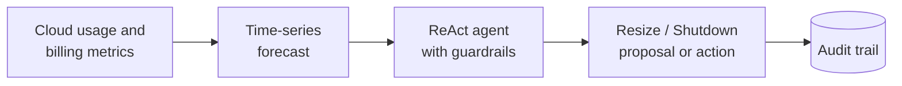
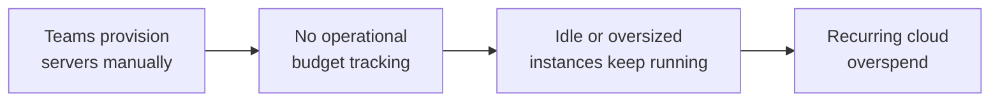
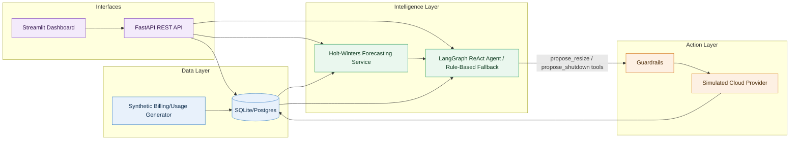
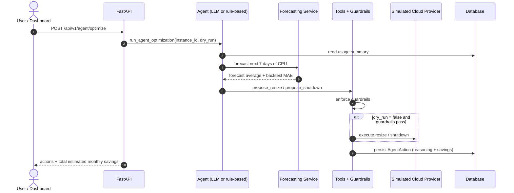
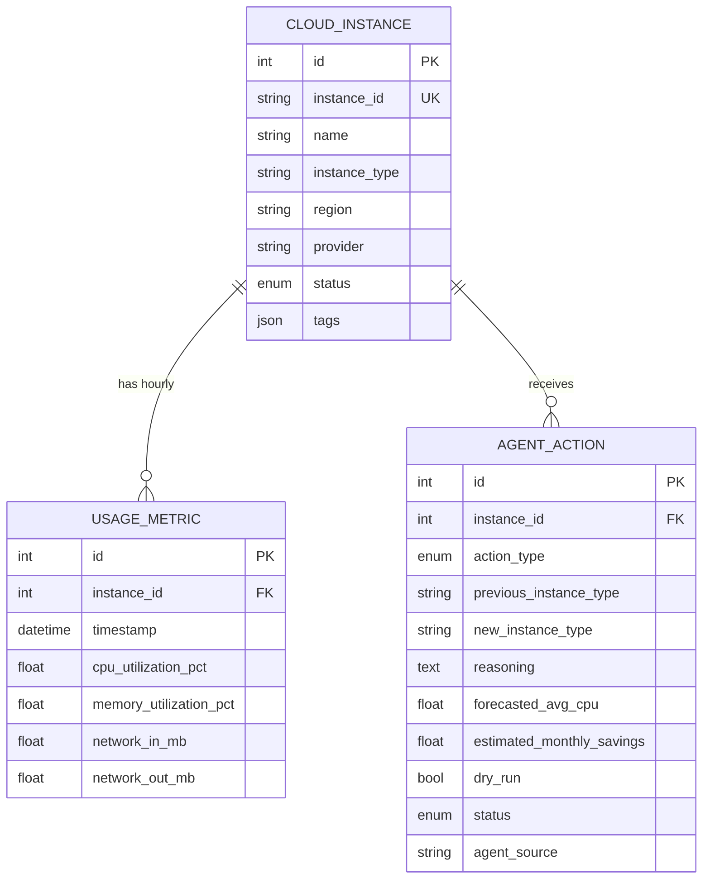

# FinOps Optimization Agent

<!--
IMAGE PLACEHOLDER 1 (hero banner)
Save your image as: docs/images/banner.png  (suggested size: 1600x400)
Then delete this comment block and uncomment the line below:

-->

  
  
  
  
  
  

An autonomous, tool-calling LLM agent that forecasts cloud compute utilization
and proposes (or executes) cost-optimizing resize/shutdown actions — a
production-shaped prototype of a corporate FinOps automation system.

## Table of Contents

- [Overview](#overview)
- [Problem Statement](#problem-statement)
- [Motivation](#motivation)
- [Target Users](#target-users)
- [Key Features](#key-features)
- [Architecture](#architecture)
  - [System Workflow](#system-workflow)
- [AI/ML/GenAI Methodology](#aimlgenai-methodology)
- [Technology Stack](#technology-stack)
- [Project Structure](#project-structure)
- [Setup Instructions](#setup-instructions)
- [Environment Variables](#environment-variables)
- [Running Locally](#running-locally)
- [Usage Examples](#usage-examples)
  - [API Usage](#api-usage)
  - [Dashboard Walkthrough](#dashboard-walkthrough)
- [Results](#results)
- [Testing](#testing)
- [Evaluation Methodology](#evaluation-methodology)
- [Limitations](#limitations)
- [Future Improvements](#future-improvements)
- [License](#license)
- [Author](#author)

## Overview

The FinOps Optimization Agent watches the utilization of a fleet of cloud
compute instances, forecasts the next 7 days of CPU demand, and decides, under
an explicit policy, whether each instance should be **resized**, **shut down**
or **left alone**. Every decision is explainable, auditable and safe to preview
with `dry_run`.

| | |
|---|---|
| **Forecasting** | Holt-Winters seasonal time-series model with a moving-average fallback |
| **Decision-making** | LangGraph ReAct tool-calling agent, or a deterministic rule-based engine when no API key is set |
| **Safety** | Guardrails enforced at the tool layer: production instances can never be shut down |
| **Auditability** | Every decision is stored with numeric reasoning and estimated monthly savings |
| **Evaluation** | Golden, hand-labeled dataset with per-case accuracy reporting |
| **Interfaces** | FastAPI REST API (auto-generated OpenAPI docs) and a Streamlit dashboard |

```mermaid
flowchart LR
    A["Cloud usage and<br/>billing metrics"] --> B["Time-series<br/>forecast"]
    B --> C["ReAct agent<br/>with guardrails"]
    C --> D["Resize / Shutdown<br/>proposal or action"]
    D --> E[("Audit trail")]
```

## Problem Statement

Engineering teams routinely over-provision cloud compute and forget to scale
it back down. Enterprises lose meaningful budget every month to idle or
oversized EC2-style instances because right-sizing requires someone to
continuously correlate utilization history, forecast near-term demand, and
weigh that against the blast radius of touching a production system — work
that rarely happens manually at scale.

```mermaid
flowchart LR
    P1["Teams provision<br/>servers manually"] --> P2["No operational<br/>budget tracking"]
    P2 --> P3["Idle or oversized<br/>instances keep running"]
    P3 --> P4["Recurring cloud<br/>overspend"]
```

## Motivation

This project applies Operations Research and Managerial Accounting ideas
(cost-center management and operational-expenditure control) to cloud
infrastructure, a discipline known as **FinOps**. Right-sizing is a
decision-under-uncertainty problem: act too late and money is wasted, act too
aggressively and a production system breaks. The goal is to show how
forecasting, an LLM agent and hard safety rules can work together so that
cost decisions are fast, explainable and bounded by policy.

## Target Users

- **Platform/DevOps/SRE teams** who own a cloud budget and want automated,
policy-bound right-sizing recommendations.
- **FinOps/engineering leadership** who need auditable, explainable cost
optimization decisions rather than an opaque "auto-scaler."

## Key Features

| Area | What it does |
|---|---|
| **Usage telemetry** | Synthetic but realistic hourly usage telemetry generation (idle, business-hours, steady-high and spiky profiles) standing in for a CloudWatch-style billing/metrics feed. |
| **Forecasting** | Holt-Winters seasonal time-series forecasting of CPU utilization, with automatic fallback to a moving-average model when history is too short, and self-reported backtest MAE. |
| **LLM agent** | A **LangGraph ReAct tool-calling agent** that reasons over usage summaries and forecasts, then calls `propose_resize` / `propose_shutdown` tools against a simulated cloud control plane. |
| **Rule-based engine** | A **deterministic rule-based policy engine** implementing the exact same FinOps policy — used automatically when no LLM API key is configured, and used as the ground-truth baseline in the evaluation harness. |
| **Guardrails** | **Guardrails enforced at the tool layer** (not just the prompt): production-tagged instances can never be shut down, regardless of what the LLM decides. |
| **Safe execution** | `dry_run` semantics end-to-end: every action can be previewed before execution. |
| **Evaluation** | An evaluation harness that scores agent decisions against a golden, hand-labeled dataset and reports accuracy. |
| **Dashboard** | A Streamlit dashboard for fleet overview, forecasts, and triggering agent runs. |

## Architecture

<!--
IMAGE PLACEHOLDER 2 (architecture illustration)
Save your image as: docs/images/architecture.png  (suggested size: 1400x800)
Then delete this comment block and uncomment the line below:

-->

```mermaid
flowchart LR
    subgraph DL["Data Layer"]
        B["Synthetic Billing/Usage Generator"] --> DB[("SQLite/Postgres")]
    end

    subgraph IL["Intelligence Layer"]
        DB --> F["Holt-Winters Forecasting Service"]
        F --> A["LangGraph ReAct Agent / Rule-Based Fallback"]
        DB --> A
    end

    subgraph AL["Action Layer"]
        A -->|"propose_resize / propose_shutdown tools"| G["Guardrails"]
        G --> CP["Simulated Cloud Provider"]
        CP --> DB
    end

    subgraph IF["Interfaces"]
        API["FastAPI REST API"] --> A
        API --> F
        API --> DB
        UI["Streamlit Dashboard"] --> API
    end

    classDef data fill:#e8f1fb,stroke:#3b82c4,color:#0b2a4a;
    classDef intel fill:#eaf7ee,stroke:#2e9e5b,color:#0d3a1f;
    classDef action fill:#fdf0e3,stroke:#d9822b,color:#4a2a05;
    classDef iface fill:#f3eafb,stroke:#8a4fc4,color:#2e0f4a;
    class B,DB data;
    class F,A intel;
    class G,CP action;
    class API,UI iface;
```

### System Workflow

1. Usage telemetry (hourly CPU/memory/network) accumulates per instance.
2. On an optimize request, the forecasting service fits a seasonal
Holt-Winters model (or falls back to a moving average) to project CPU
utilization over the next 7 days.
3. The agent — LLM ReAct if `LLM_PROVIDER` is configured with a key,
otherwise the deterministic rule-based engine — evaluates trailing +
forecasted CPU against policy thresholds and the instance's
`criticality` tag.
4. The agent calls a tool to propose (or, if `dry_run=False`, execute) a
`resize` or `shutdown`. Tools enforce guardrails independently of the
agent's reasoning (e.g. production instances can never be shut down).
5. Every decision is persisted as an `AgentAction` row with its numeric
reasoning and estimated monthly savings, giving a full audit trail.

```mermaid
sequenceDiagram
    autonumber
    actor U as User / Dashboard
    participant API as FastAPI
    participant AG as Agent (LLM or rule-based)
    participant FC as Forecasting Service
    participant TL as Tools + Guardrails
    participant CP as Simulated Cloud Provider
    participant DB as Database

    U->>API: POST /api/v1/agent/optimize
    API->>AG: run_agent_optimization(instance_id, dry_run)
    AG->>DB: read usage summary
    AG->>FC: forecast next 7 days of CPU
    FC-->>AG: forecast average + backtest MAE
    AG->>TL: propose_resize / propose_shutdown
    TL->>TL: enforce guardrails
    alt dry_run = false and guardrails pass
        TL->>CP: execute resize / shutdown
    end
    TL->>DB: persist AgentAction (reasoning + savings)
    API-->>U: actions + total estimated monthly savings
```

### Data Model

```mermaid
erDiagram
    CLOUD_INSTANCE ||--o{ USAGE_METRIC : "has hourly"
    CLOUD_INSTANCE ||--o{ AGENT_ACTION : "receives"

    CLOUD_INSTANCE {
        int id PK
        string instance_id UK
        string name
        string instance_type
        string region
        string provider
        enum status
        json tags
    }
    USAGE_METRIC {
        int id PK
        int instance_id FK
        datetime timestamp
        float cpu_utilization_pct
        float memory_utilization_pct
        float network_in_mb
        float network_out_mb
    }
    AGENT_ACTION {
        int id PK
        int instance_id FK
        enum action_type
        string previous_instance_type
        string new_instance_type
        text reasoning
        float forecasted_avg_cpu
        float estimated_monthly_savings
        bool dry_run
        enum status
        string agent_source
    }
```